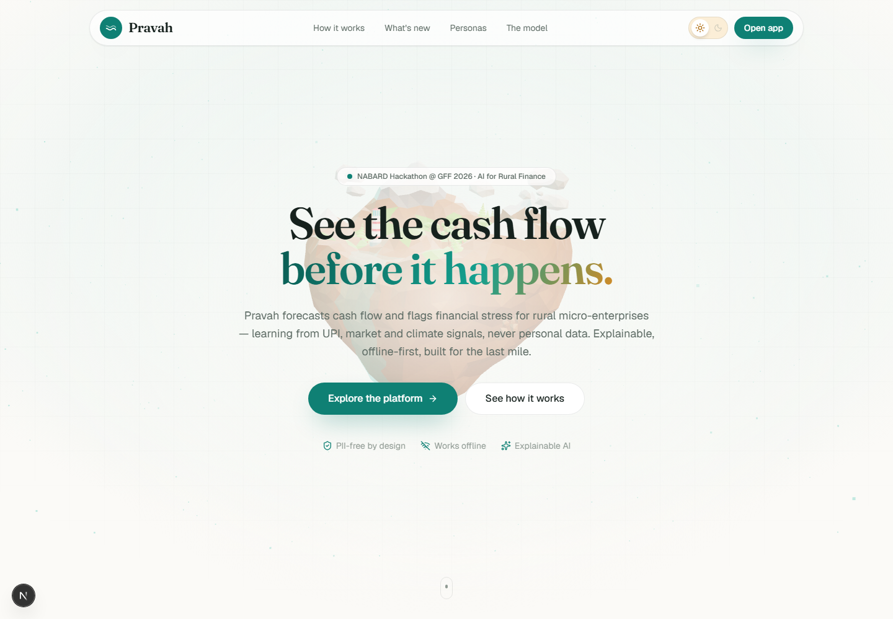
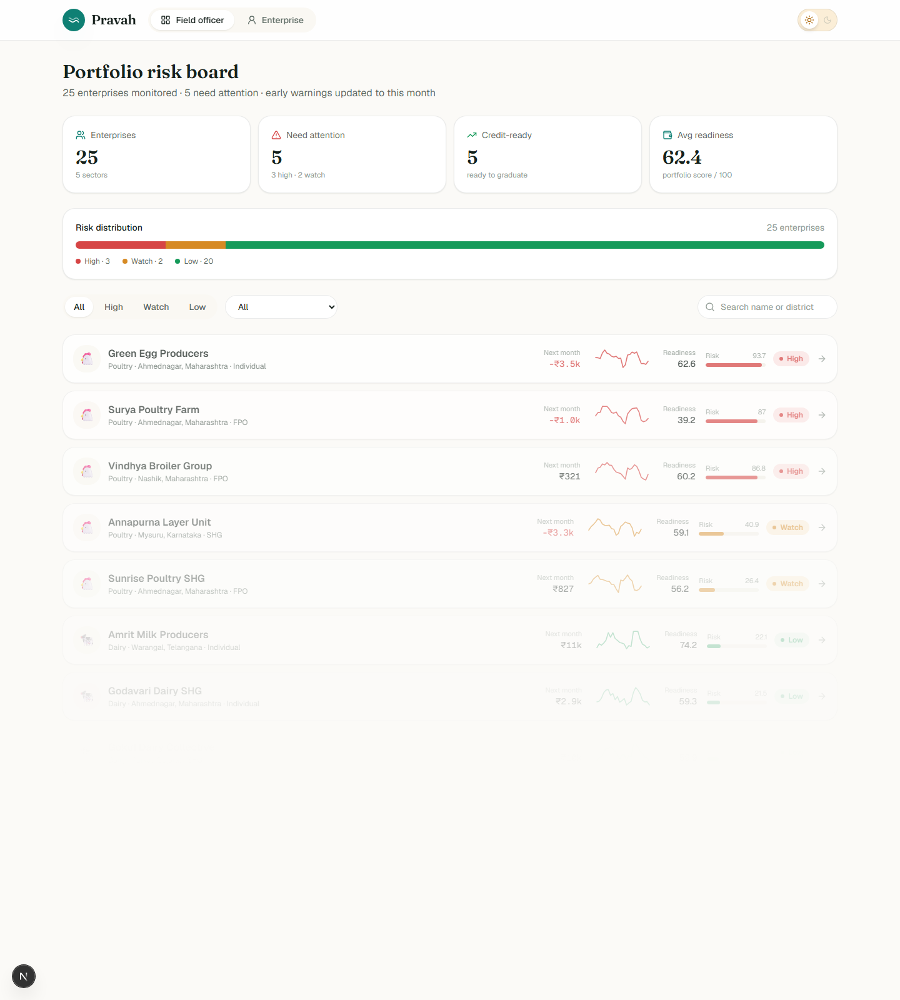
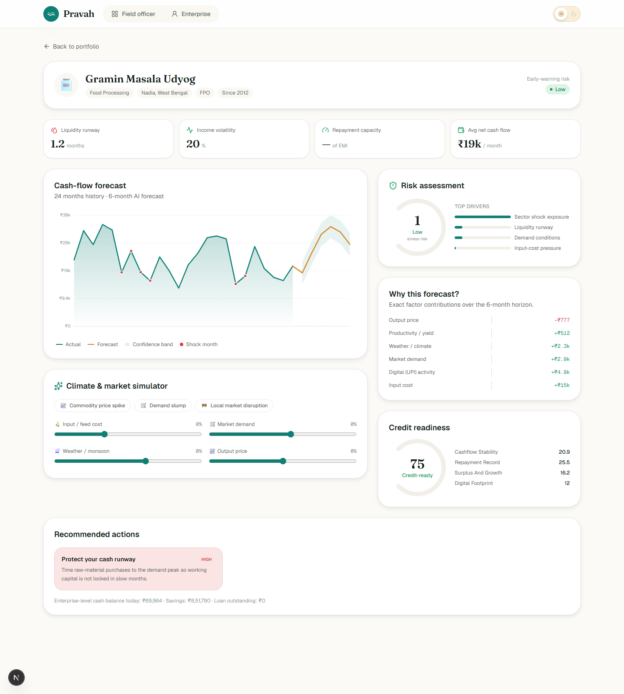
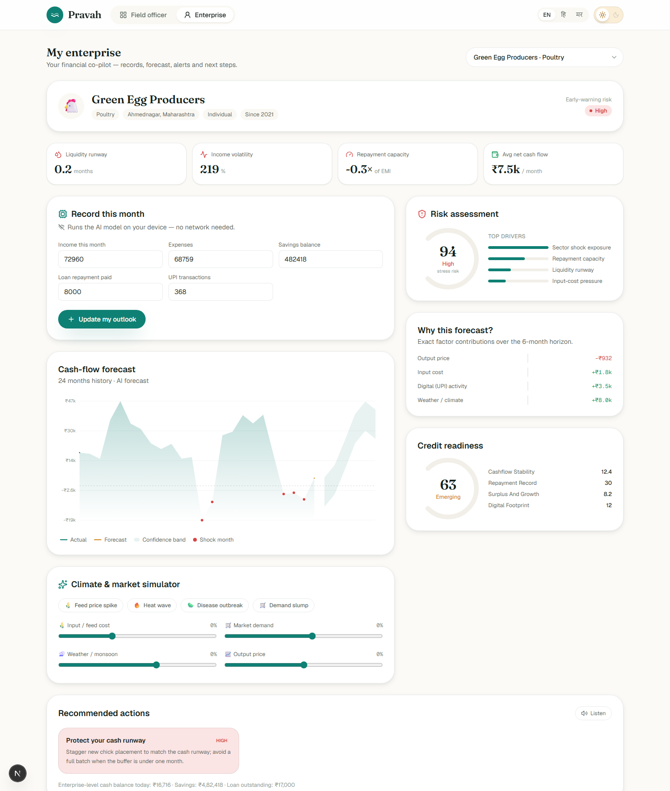
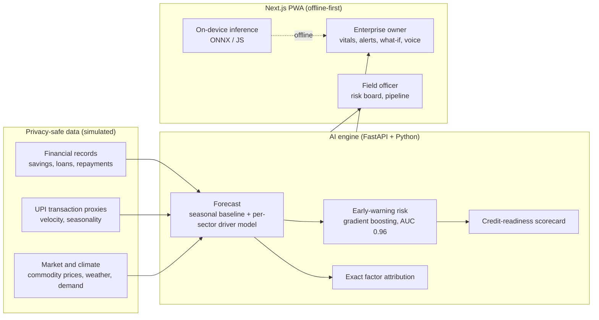

<div align="center">


<p>
  
  
  
  
</p>

<p>
  
  
  
  
  
  
  
  
  
  
  
</p>

<br/>

> ### Other teams build a dashboard with a line chart. We built a Digital Public Good that turns thin-file rural enterprises into credit-ready borrowers.
> An explainable, offline-first AI platform that predicts cash flow 3 to 6 months ahead and flags financial stress before it happens, using only privacy-safe proxy signals, never personal data.

<br/>



</div>

---

## Table of Contents

- [The Problem](#the-problem)
- [What We Built](#what-we-built)
- [Live Demo](#live-demo)
- [A Guided Tour](#a-guided-tour)
- [The AI, Honestly](#the-ai-honestly)
- [Six Ideas That Set Us Apart](#six-ideas-that-set-us-apart)
- [Feature Highlights](#feature-highlights)
- [Architecture](#architecture)
- [Tech Stack](#tech-stack)
- [The Models and Data](#the-models-and-data)
- [Two Personas](#two-personas)
- [Getting Started](#getting-started)
- [Deployment](#deployment)
- [Value for NABARD](#value-for-nabard)
- [Project Structure](#project-structure)
- [Team Synora](#team-synora)

---

## The Problem

India has more than 6 crore rural micro-enterprises: SHGs, FPOs and individual entrepreneurs. Most are **thin-file**, they have no formal credit history, so they stay locked out of timely, structured finance.

The current way of monitoring their financial health is largely manual, so institutions and field officers cannot anticipate risk:

- There is **no integrated, data-driven system** that fuses financial data with UPI trends, market intelligence and climate signals to predict future cash flow.
- As a result, **early warnings of financial stress are missed**, leading to delayed interventions, liquidity crises and avoidable credit risk.

Yet the data to understand these enterprises already exists in the digital rural economy: UPI activity, mandi and commodity prices, demand trends, weather and crop calendars. It is simply underused.

**Pravah turns those underused signals into foresight.**

---

## What We Built

A complete, working prototype that covers the full loop, for both the micro-enterprise and the field officer:

```
Record  ->  Forecast  ->  Flag  ->  Act  ->  Graduate
income &    3 to 6 mo     early     sector    thin-file to
expenses    cash flow     warning   playbook  formal credit
```

- A **premium, scroll-reactive 3D landing page** (React Three Fiber) with a light and dark theme.
- A **field-officer command center**: a portfolio risk board ranking every enterprise Low / Watch / High, with a credit-readiness pipeline.
- An **enterprise owner dashboard**: financial vital signs, an explainable forecast, early alerts and concrete next steps.
- A **climate and market what-if simulator**: drag a shock and watch the forecast and risk re-rate live.
- **On-device AI**: the early-warning model runs in the browser with zero network.
- **Explainable by default**: every forecast and risk flag shows the exact factors behind it.
- **Multilingual (English, Hindi, Marathi) with voice output**, for the low-literacy last mile.
- **Offline-first PWA**, built for low-network villages.

---

## Live Demo

The frontend runs **fully standalone** from a committed dataset bundle, so it deploys to Vercel in minutes with no backend required, and it works offline after the first visit.

<!-- After deploying, add your Vercel URL here, e.g. https://pravah.vercel.app -->

There is no login. Explore both experiences directly:

| Experience | Route | What you see |
|------------|-------|--------------|
| Field officer | `/officer` | Portfolio risk board, filters, credit-readiness pipeline |
| Enterprise owner | `/app` | Vital signs, forecast, what-if simulator, on-device data entry |
| Enterprise profile | `/enterprise/[id]` | Full drill-down for any enterprise |

To run it yourself, see [Getting Started](#getting-started).

<p align="center">
  
</p>

---

## A Guided Tour

### The scroll-reactive landing

A cinematic 3D hero sits behind the story and reacts to scroll, with an animated light and dark theme toggle, magnetic buttons and reveal-on-scroll sections. It states the thesis, the six novelties, the honest model metrics and the NABARD value mapping.

### Field-officer command center

Twenty-five enterprises, ranked by early-warning risk. Notice the pattern in the demo data: the three highest-risk enterprises are all **poultry**, because a feed-price shock is rippling through the sector, and Pravah caught it early. Filter by band or sector, then drill into any profile.

<p align="center">
  
</p>

### Enterprise dashboard, forecast and what-if

Financial vital signs (liquidity runway, income volatility, repayment capacity), a cash-flow chart with a 6-month forecast and confidence band, an explainable "why this forecast" panel, a risk gauge, a credit-readiness scorecard and an action playbook. The **climate and market simulator** re-forecasts and re-rates risk live as you apply shocks.

<p align="center">
  
</p>

### Owner view with on-device inference

The owner records this month's figures and the AI model recomputes risk **on their device**, with no network, updating the outlook instantly. Insights come in the chosen language and can be read aloud.

<p align="center">
  
</p>

---

## The AI, Honestly

Real, trained models, measured with walk-forward backtests on simulated multi-sector data. No cherry-picking, no black box.

| Metric | Result | What it measures |
|--------|:------:|------------------|
| Early-warning AUC | **0.96** | Detecting financial stress within the next 3 months (held out) |
| Forecast R2 | **0.65** | 6-month cash-flow forecast accuracy (walk-forward) |
| Directional accuracy | **77%** | Getting the up or down move right |
| Coverage | **25** enterprises, **5** sectors, **12** risk features | Breadth of the simulated portfolio |

Every prediction is decomposable: the forecast breaks into exact factor contributions, and each risk flag names its drivers.

---

## Six Ideas That Set Us Apart

Not hackathon gimmicks. Each one solves a real problem in rural credit.

| Idea | Why it matters |
|------|----------------|
| **Alternative-data scoring, no PII** | Forecasts from proxy signals (UPI velocity, mandi prices, weather), not personal or account data. Solves the thin-file problem directly. |
| **Explainable by default** | Every forecast decomposes into exact factor contributions; every risk flag names its drivers. Field officers trust what explains itself. |
| **Sector digital-twins** | Purpose-built cash-flow models for dairy, poultry, food processing, handicrafts and rural retail, each with its own seasonality and shocks. |
| **Climate and market what-if** | Drag a slider ("monsoon delayed", "feed +15%") and the forecast and risk re-rate live. Proactive, not reactive. |
| **Offline-first, on-device AI** | The gradient-boosting model runs in the browser via ONNX and a tiny JS evaluator, with zero network. Built for villages. |
| **Grant-to-credit pipeline** | A transparent credit-readiness scorecard plus action playbooks graduate enterprises from grants toward formal credit. |

---

## Feature Highlights

| Feature | What it does |
|---------|-------------|
| **Scroll-reactive 3D landing** | React Three Fiber hero, animated light and dark toggle, magnetic buttons, reveal-on-scroll |
| **Portfolio risk board** | Every enterprise ranked Low / Watch / High, with filters, sparklines and a distribution bar |
| **Explainable forecast** | 6-month cash flow with a confidence band and exact per-driver attribution |
| **Early-warning risk** | Gradient-boosting classifier (AUC 0.96) with readable top drivers |
| **What-if simulator** | Live re-forecast and risk re-rating under climate and market shocks |
| **On-device inference** | The risk model runs in-browser (ONNX / JS), verified to match the server |
| **Credit readiness** | A transparent scorecard mapping the grant to formal-credit pathway |
| **Action playbooks** | Concrete, sector-specific next steps, not just alerts |
| **Multilingual + voice** | English, Hindi and Marathi with Web Speech read-aloud |
| **Offline PWA** | Service worker precache, works in low-network and no-network conditions |

---

## Architecture



- **Two-layer codebase**: a Next.js frontend and a Python FastAPI backend that trains and serves the models.
- **Offline-first**: models are exported to ONNX and compact JSON, and a data bundle is committed, so the app browses and simulates with zero network and syncs when back online.
- **Privacy by design**: only anonymised proxy indices are used, never sensitive personal or account data.

---

## Tech Stack

<table>
<tr>
<td valign="top" width="50%">

### Application
| Layer | Technology |
|-------|-----------|
| Framework | Next.js 16 (App Router) |
| UI | React 19 + TypeScript 5 |
| Styling | Tailwind CSS 4 (CSS-first tokens) |
| Motion | Framer Motion + Lenis |
| 3D | React Three Fiber + drei + three |
| Theme | next-themes (light default + animated toggle) |
| Offline | PWA service worker + IndexedDB-friendly bundle |
| Hosting | Vercel |

</td>
<td valign="top" width="50%">

### AI and Data
| Layer | Technology |
|-------|-----------|
| API | FastAPI (Python 3.14) |
| ML | scikit-learn (gradient boosting, ridge) |
| Numerics | NumPy, pandas, statsmodels |
| Forecast | seasonal-trend baseline + per-sector driver model |
| Explainability | exact linear factor attribution |
| Edge inference | ONNX (skl2onnx / onnxruntime) + pure-JS tree evaluator |
| i18n and voice | EN / HI / MR + Web Speech API |

</td>
</tr>
</table>

---

## The Models and Data

Everything runs on privacy-safe **simulated** data, as the problem statement allows, and no sensitive personal information is used.

- **Synthetic multi-sector data.** A seeded generator produces three aligned layers: enterprise financials, anonymised UPI proxies, and sector/region driver signals (prices, demand, weather, productivity), with realistic seasonal shocks.
- **Cash-flow forecast.** An additive model: a per-enterprise seasonal-trend baseline plus a per-sector, sign-constrained driver-response regression. Because it is linear, each driver's rupee contribution is an exact, physically-sensible attribution.
- **Early-warning risk.** A gradient-boosting classifier estimates the probability of financial stress in the next 3 months from financial, digital-proxy and external-pressure features. Exported to ONNX and to compact JSON for on-device inference.
- **Credit readiness.** A transparent, lender-readable scorecard (stability, repayment record, surplus and growth, digital footprint) that maps the grant to formal-credit pathway.
- **Action playbooks.** Sector-specific corrective steps keyed to the dominant risk factor.

---

## Two Personas

| | Enterprise owner (`/app`) | Field officer (`/officer`) |
|--|--------------------------|----------------------------|
| Goal | Understand and protect my cash flow | Monitor and prioritise a portfolio |
| Sees | Vital signs, forecast, alerts, playbook, what-if | Risk board, profiles, forecasts, credit-readiness pipeline |
| Extras | Data entry with on-device recompute, multilingual, voice | Filters, sparklines, sector view, at-risk queue |

---

## Getting Started

### Prerequisites
- Node.js 20+
- Python 3.11+ (only if you want to retrain or run the live API; the frontend runs standalone without it)

### Frontend (standalone, no backend needed)

```bash
git clone https://github.com/atharva-awade/Team-Synora-NABARD-2026.git
cd Team-Synora-NABARD-2026/frontend

npm install
npm run dev
```

Open `http://localhost:3000`. The app loads a committed data bundle, so both personas work immediately, and it works offline.

### Backend (optional: retrain and serve the live API)

```bash
cd backend
python -m venv .venv
.venv\Scripts\activate            # on Windows
# source .venv/bin/activate       # on macOS / Linux

pip install -r requirements.txt

# Train the models (generates the simulated portfolio, fits and evaluates)
python -m app.ml.train

# Export models to ONNX + rebuild the frontend data bundle
python -m app.ml.export_onnx

# Serve the API
uvicorn app.main:app --reload
```

The API serves at `http://localhost:8000` (docs at `/docs`).

---

## Deployment

- **Frontend on Vercel.** Import the repo, set the root to `frontend`, and deploy. Next.js is auto-detected. The app is standalone (it ships with a data bundle and on-device models), so no backend or database is required for the demo.
- **Backend (optional) on Render or Railway.** Deploy the `backend` FastAPI service if you want the live retraining and API path.

---

## Value for NABARD

Pravah maps directly onto NABARD's four value-creation goals.

1. **Enhanced credit flow.** Reliable cash-flow forecasts and risk profiles give lenders a cash-flow-based appraisal signal for thin-file enterprises.
2. **Credit-led rural development.** A readiness pipeline helps enterprises demonstrate repayment capacity and graduate from grants to institutional finance.
3. **A Digital Public Good.** An open, API-first, privacy-safe layer for enterprise profiling, cash-flow assessment and risk monitoring.
4. **Better beneficiary outcomes.** Owners get simple, actionable insight into performance and market risk, in their language, offline.

---

## Project Structure

```
Team-Synora-NABARD-2026/
├── backend/
│   └── app/
│       ├── ml/              # data generator, forecast + risk models,
│       │                    # training pipeline, ONNX + bundle export
│       ├── services/        # store + analysis (composes model outputs)
│       ├── api/             # FastAPI routes
│       ├── sectors.py       # sector digital-twin definitions
│       ├── schemas.py       # request/response models
│       └── main.py          # FastAPI app
├── frontend/
│   ├── app/                 # landing, /officer, /app, /enterprise/[id]
│   ├── components/
│   │   ├── landing/         # hero + marketing sections
│   │   ├── three/           # React Three Fiber scene
│   │   ├── officer/         # portfolio risk board
│   │   ├── enterprise/      # dashboard, what-if, data entry
│   │   ├── charts/          # custom animated SVG charts
│   │   └── ui/              # design-system primitives + interactions
│   ├── lib/                 # data, forecast + risk (JS), i18n, utils
│   └── public/
│       ├── data/            # committed offline data bundle
│       └── models/          # ONNX + JS models, 3D asset
└── docs/screenshots/
```

---

## Team Synora

Built for the **NABARD Hackathon @ GFF 2026** by **Team Synora**.

Our thesis in one line: other teams build a dashboard; we built the Digital Public Good that turns thin-file rural enterprises into credit-ready borrowers.

<div align="center">

<br/>


</div>
